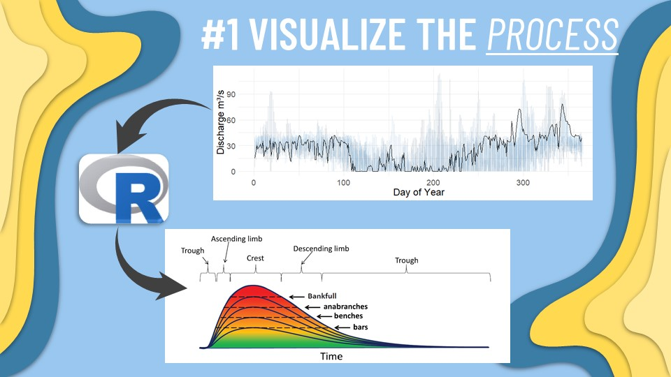

<!-- README.md is generated from README.Rmd. Please edit that file -->

```{r, include = FALSE}
knitr::opts_chunk$set(
  collapse = TRUE,
  comment = "#>",
  fig.path = "man/figures/README-",
  out.width = "100%"
)
```

# Riverwave

<!-- badges: start -->
<!-- badges: end -->

The goal of Riverwave is to transform standard gauge station data into relevant ecological theory to foster understanding of river behavior.

## Installation

You can install the development version from [GitHub](https://github.com/) with:

``` r
# install.packages("devtools")
devtools::install_github("henryhansen/Riverwave")
```
## Example gauge station download

This is a basic example which shows you how to download some gauge station data from SMHI:

```{r example}
library(Riverwave)
## basic example
head(Riverwave::smhi_csv(274))
```

The visualization concept for this package follows the idea presented in the [riverwave paper](https://academic.oup.com/bioscience/article/64/10/870/1780369):


```{PlantUML}
@startuml

SMHI : Date
SMHI : Discharge
SMHI : Quality

SMHI -> Riverwave
Riverwave --> [*]
Riverwave : Calculations
Riverwave : Conversions
Riverwave : Estimation

Riverwave -> Riverwave_Shiny
Riverwave_Shiny : Mapping
Riverwave_Shiny : Visualization
Riverwave_Shiny : Reports

Riverwave_Shiny --> [*]

@enduml

```
